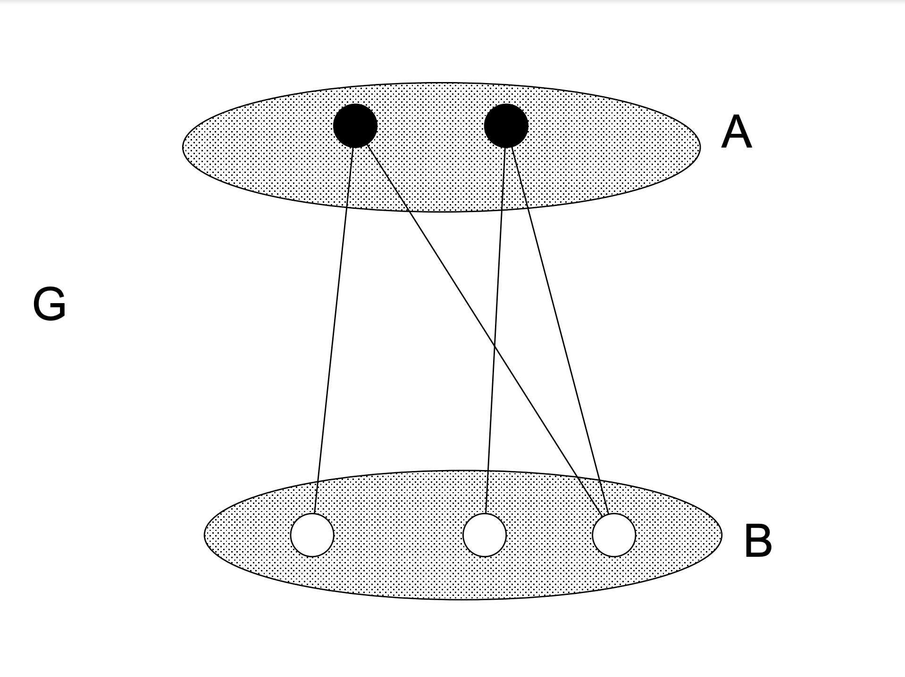

## 二部グラフとは
> グラフGの点集合を2つの素な集合A, Bに分割し, Gの全ての辺はAの点とBの点を結ぶようにできたとする. このとき, グラフGは二部グラフであるという.

この図がわかりやすい．

引用元: https://eprints.lib.hokudai.ac.jp/dspace/bitstream/2115/28239/18/GRAPH2007.pdf

## 参考
- [グラフ理論 講義ノート](https://ocw.hokudai.ac.jp/wp-content/uploads/2016/01/GraphTheory-2007-Note-03.pdf)
  - This document is protected by the [CC BY-NC-SA 2.1 JP license](https://creativecommons.org/licenses/by-nc-sa/2.1/jp/legalcode)([Distribution site](https://eprints.lib.hokudai.ac.jp/dspace/handle/2115/28239)).
